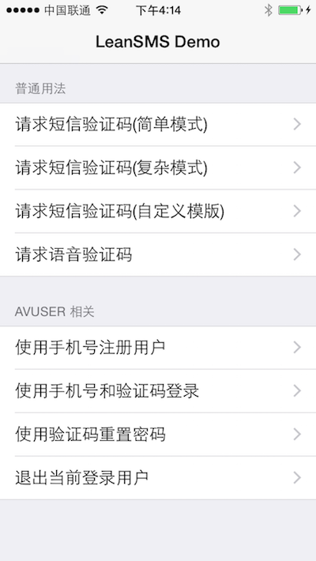

# leancloud-smsdemo-iOS

LeanCloud SMS Demo 是 [LeanCloud](https://leancloud.cn) 开源的一个短信 demo 程序，支持的功能如下图所示：



LeanCloud 短信服务目前可以提供：

* 发送简单的文本验证码
* 按照自定义模版发送复杂的文本短信（验证码和非验证码都支持）
* 发送语音验证码
* 与账号系统相关的一些功能，譬如：
  * 手机号＋验证码注册
  * 手机号＋验证码登录
  * 手机号＋验证码重置密码

具体内容可以参考文档[LeanCloud 短信验证 API](https://leancloud.cn/docs/rest_sms_api.html)

## 如何贡献
你可以通过提 issue 或者发 pull request 的方式，来贡献代码。开源世界因你我参与而更加美好。

## 项目结构
整个 repo 结构如下：

```
.
├── Podfile          <---- 由 cocoapods 管理的编译依赖
├── LeanCloudDemoTests
├── LeanCloudDemo    <---- demo 主要代码
└── README.md
```

## 如何运行 demo

* 在根目录下，执行 `pod update` 来自动解决编译依赖；
* 在根目录下，执行 `open LeanCloudSMSDemo.xcworkspace` 命令，打开工程
* 修改 AppDelegate.m 文件中的如下代码行（使用你应用的 appId/appKey 来替换下面的初始化语句）：

```
- (BOOL)application:(UIApplication *)application didFinishLaunchingWithOptions:(NSDictionary *)launchOptions {
    // Override point for customization after application launch.
    [AVOSCloud setApplicationId:@"yourAppId"
                      clientKey:@"yourAppKey"];

    return YES;
}
```

## 其他问题
暂无
